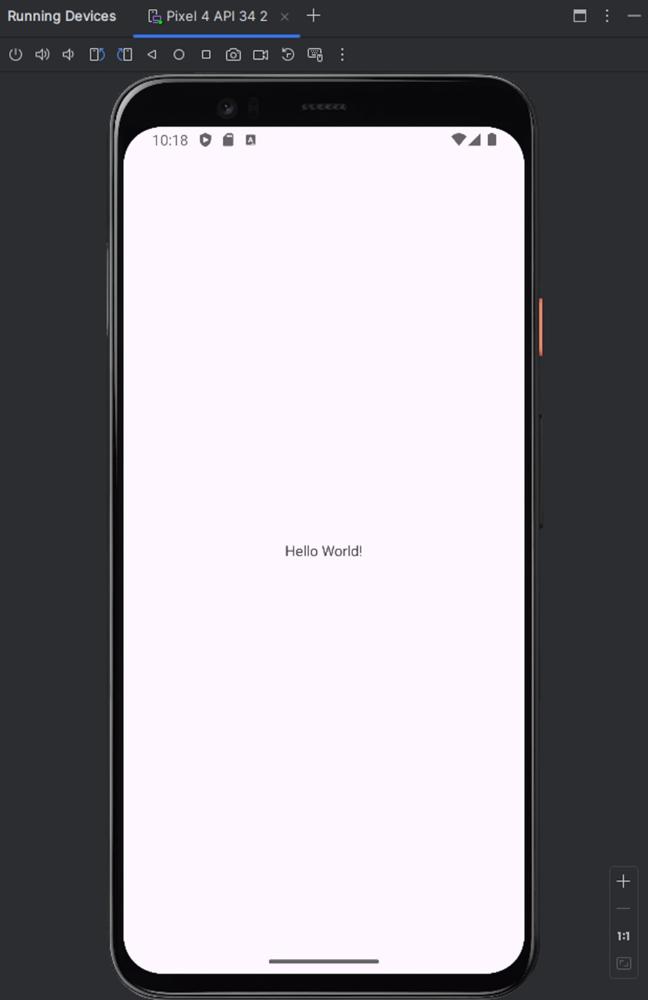
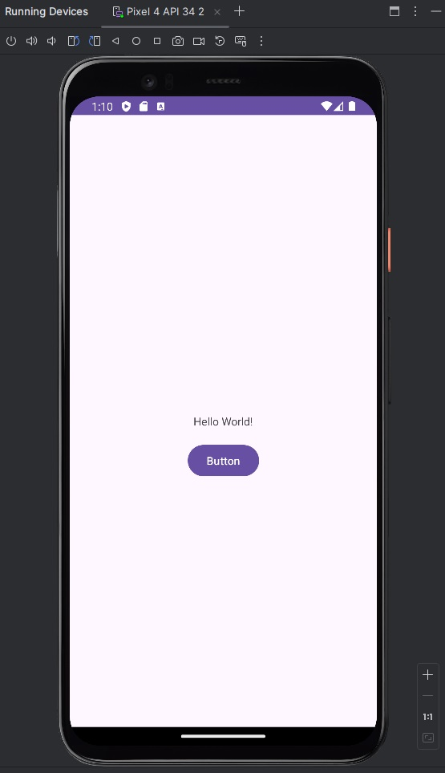
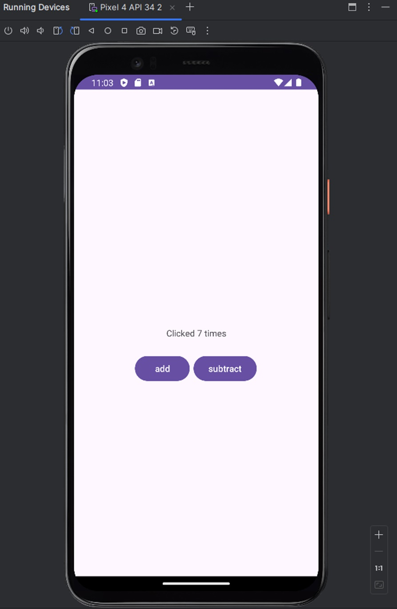

# Część praktyczna
## Zadanie 1
- Stworzenie nowego projektu w Android Stuido oraz konfiguracja środowiska
  - uruchom środowisko i wybierz **Empty Views Activity**
  - wybierz język **Java**
  - w oknie Build configuration language wybierz **Groovy DSL (build.gradle)**
  
- Teraz kiedy już stworzyliśmy nowy projekt potrzebujemy skonfigurować emulator urządzenia mobilnego
  - w prawym górnym rogu w zakładce Device Manager wybierz **Create Virtual Device**
  - znajdź urządzenie **Pixel 4** i w następnej zakładce wybierz obraz systemu **UpsideDownCake**
  - uruchom aplikacje (to może chwile potrwać), powinieneś zobaczyć `Hello World!` na ekranie nowo stworzonego emulatora
> 
 
 ## Zadanie 2
- Stworzenie interfejsu użytkownika
  - przejdź to pliku `activity_main.xml` i upewnij się że jesteś w trypie **Design**
  - w menu po lewej stronie odszukaj **Button** i przeciągnij go pod tekst Hello World
  - uruchom aplikacje i sprawdź czy przycisk faktycznie znajduje się tam, gdzie go umieściłeś, **jeśli nie to napraw to**
> 
 
## Zadanie 3
- Dodanie funkcjonalności do aplikacji
  - zmień tekst wyświetlany na przycisku na `add` 
  - analogicznie dodaj drugi przycisk i spróbuj samodzielnie stworzyć aplikacje która po kliknięciu **add** zwiększa licznik kliknięć i wyświetla go na ekranie oraz po kliknięciu nowo utworzonego **subtract** go zmniejsza
> 
 
